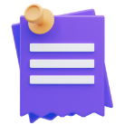

# 📝 Notes App

A simple, clean web app to jot down quick notes right in your browser — no sign-up, no backend, no fuss. Your notes are saved automatically and stick around even after you close the tab.



## ✨ Features

- **Create notes** with a single click
- **Edit anytime** — just click into a note and start typing
- **Delete notes** you no longer need
- **Auto-save** — your notes are remembered even after refreshing or closing the browser
- Smooth purple gradient design 💜

## 🚀 How to Use

1. Download or clone this project folder
2. Open `index.html` in your web browser (just double-click it)
3. Click the **Create** button to add a new note
4. Click inside a note to type
5. Click the small delete icon on a note to remove it

That's it — no installation, no setup required!

## 📁 Project Structure

```
notes-app/
├── index.html      → the page structure
├── style.css       → the look and feel (colors, layout, spacing)
├── script.js       → the logic (creating, editing, deleting, saving notes)
└── images/
    ├── notes.png
    ├── edit.png
    └── delete.png
```

## 🛠️ Built With

- **HTML** — structure of the page
- **CSS** — styling and layout
- **JavaScript** — functionality (adding/removing notes, saving to browser storage)

## 💾 How Notes Are Saved

This app uses the browser's built-in `localStorage` — think of it as a small storage box inside your browser that remembers data even after you close the tab. Notes are saved automatically every time you type or delete, so nothing gets lost when you refresh the page.

> **Note:** Notes are only saved on the browser/device you used to create them. Clearing your browser data will also clear your notes.

## 🎨 Design Notes

- Font: [Poppins](https://fonts.google.com/specimen/Poppins)
- Color theme: Purple-to-blue gradient (`#cf9aff` → `#95c0ff`)
- Fully responsive container layout

## 📌 Possible Future Improvements

- Add a "clear all notes" button
- Add note timestamps
- Add color-coded notes
- Add search/filter functionality

## 👤 Author

Made with ❤️ as a personal project.

## 📄 License

Free to use and modify for learning purposes.